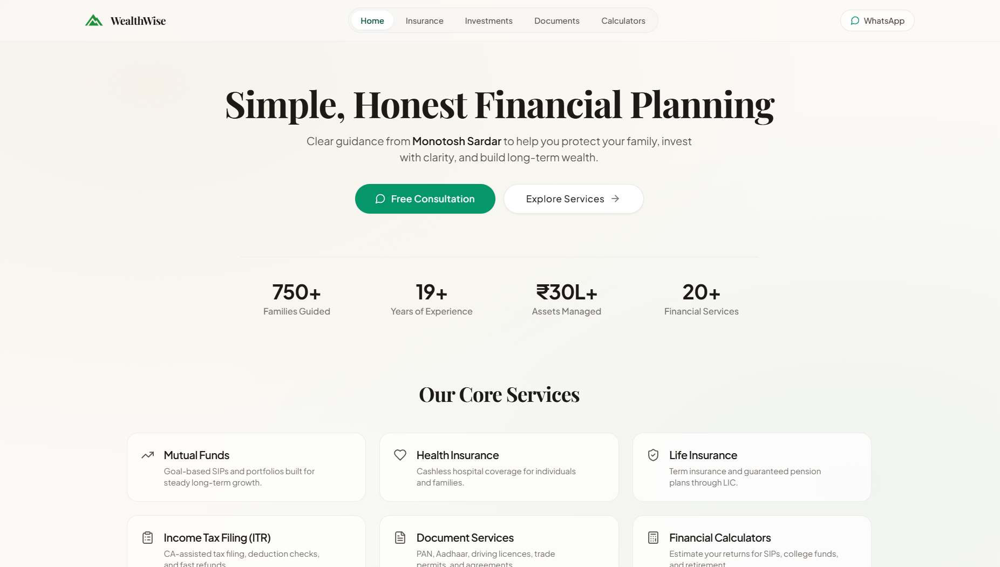

# WealthWise

A modern financial advisory and services platform based in Kolkata. Features goal-based investment calculators, insurance and mutual fund guides, a bilingual Bengali FAQ, and direct WhatsApp inquiries.

[](https://monotosh.vercel.app/)

---



---

## Features

- **Financial Calculators**: Goal-based planning for SIP, Lump Sum, SWP, Retirement, Child Education, and Marriage.
- **Service Directories**: Clear guides for mutual funds, health/life insurance, and government document services.
- **Bilingual FAQ**: Clear answers on investment safety, returns, and taxes in both English and natural Bengali.
- **WhatsApp Inquiries**: Pre-filled consultation requests and calculator projections sent straight to the advisor.
- **Customizable Advisor Profile**: Update advisor contact details, address, and metadata easily via environment variables.

---

## Tech Stack

- **Framework**: Next.js 15 (App Router), React 18, TypeScript
- **Styling**: Tailwind CSS, Radix UI, Lucide Icons
- **Deployment**: Vercel

---

## Getting Started

### 1. Setup

```bash
git clone https://github.com/ShreyanDev5/wealth-wise.git
cd wealth-wise
npm install
cp .env.example .env
```

### 2. Run Locally

```bash
npm run dev
```

Open [http://localhost:3000](http://localhost:3000) in your browser.

---

## Tests

Run the financial formula verification suite:

```bash
npm test
```

---

## Author

**Shreyan Sardar** — [Portfolio](https://shreyandev.vercel.app) · [GitHub](https://github.com/ShreyanDev5) · [LinkedIn](https://www.linkedin.com/in/shreyansardar/)
